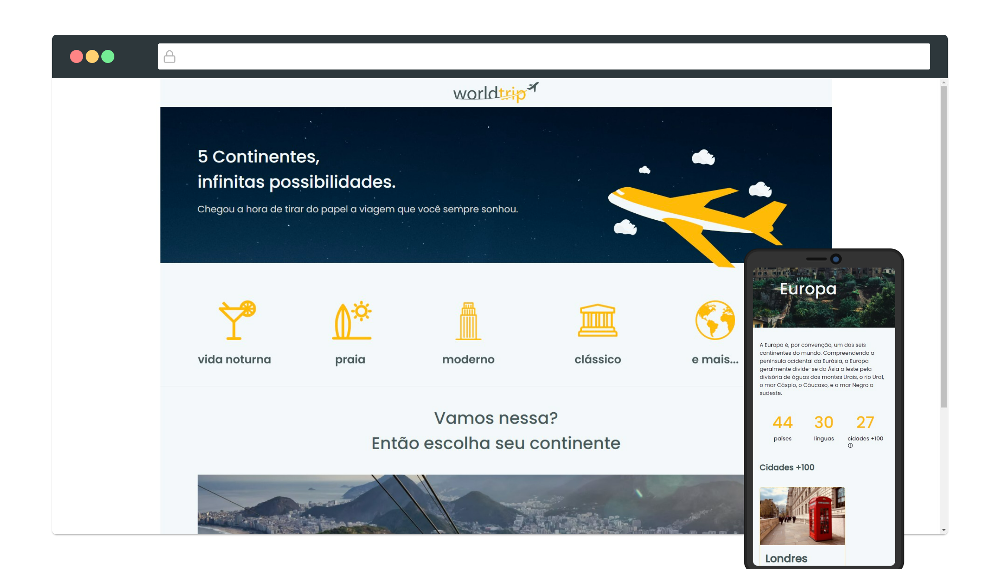

# Worldtrip

## Desafio - Interface com Chakra UI

  Desafio Ignite módulo 4, criando uma interface do zero utilizando Next.js e Chakra UI.

 

  

## Tecnologias e Ferramentas

- ReactJS
- Next.js
- Typescript
- Chakra UI

 

## Licença

 

Esse projeto está sob a licença MIT. Veja o arquivo [LICENSE](/LICENSE) para mais detalhes.
